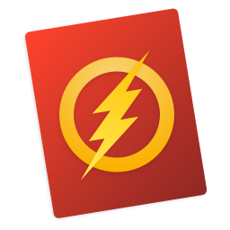

Visual Code App Icons
======================================

A fun little project for custom Microsoft® Visual Code Icons. All rights reserved to their respective owners of the themes I am using whether it is Marvel, DC or simple editor themes.

## How to Install

**Mac OS:** Copy the `.icns` file you'd like to use. Find VS Code in your Applications folder, right click the icon and select `Get Info`. Click the icon in the top right corner so that a blue highlight appears around it. `⌘ + V` to past the new icon in. It may take a few restarts of VS Code for the icon to take.

If for some reason that doesn't work, then dragging the `.icns` to the icon (in the top left) of the info pane, until you see the green plus sign and then dropping it works.

### [Xcode](https://developer.apple.com) by @apple

### [Cobalt2](https://github.com/wesbos/cobalt2-vscode) by [@wesbos](https://github.com/wesbos)

Based on the Popular Theme by Wes Bos

### [LevelUp](https://www.leveluptutorials.com) by [@stolinski](https://github.com/stolinski)

Based on Scott's <https://www.leveluptutorials.com>

### [Dracula](https://draculatheme.com) by [@zenorocha](https://github.com/zenorocha)

Dracula is my favourite theme. I use it in all editors and terminals. Even Slack :)

I didn't have just one option for it, since the theme has many interesting colors. So, I made six different ones.

     

### DC Comics

All rights reserved etc to DC. I own nothing. Just inspired by the character's costume colors :)

#### Flash

 

#### Batman

### Marvel Comics

All rights reserved etc to Marvel. I own nothing. Just inspired by the character's costume colors :)

#### Spider-Man

----

You can get in touch with me at Twitter: [@dhanishgajjar](https://twitter.com/dhanishgajjar)

I post awesome stuff at
Instagram: [@dhanishgajjar](https://instagram.com/dhanishgajjar)
