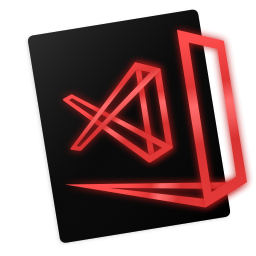
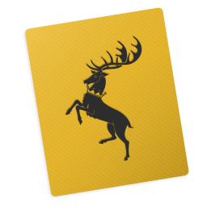
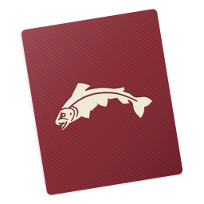
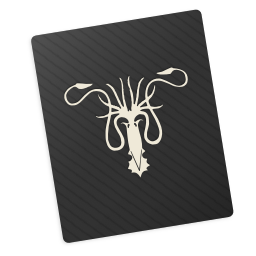
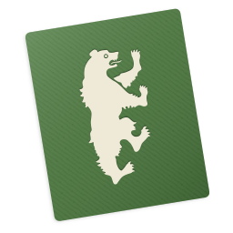
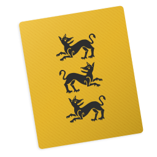

Visual Studio Code App Icons
======================================

A fun little project for custom [Microsoft® Visual Studio Code](http://code.visualstudio.com) Icons. All rights reserved with [@Microsoft](https://github.com/Microsoft) and the respective owners of the themes I am using whether it is Marvel, DC or simple editor themes.

---

## Based on Holidays
Made by [@clarkio](https://github.com/clarkio)

         

## Based on the Popular Themes

Hovering on them will reveal the names, and clicking them will take you to the theme pages.

            

## Based on Harry Potter
These icons were created by [@jessicavrooyen](https://github.com/jessicavrooyen)

   

## Based on Super Heroes

All rights reserved etc to DC and Marvel. I own nothing. Just inspired by the character's costume colors :)

          

## Based on Movies & TV Shows
           
## Based on Popular Apps
  

## Others

   

---

## How to Contribute

 - Download the sample icon sketch file.
 - Sample file has separate color layers, it makes it easy to for anyone to change colors.
 - Change the colors and create your icon, without changing any dimensions.
 - Select the artboard and export a `linux` file.
 - Select the artboard again and export a `png` file, but @0.25x (256 x 256)
 - Download the [Image2Icon](http://www.img2icnsapp.com) App
 - Drop the linux as source and export a .ICNS for macOS
 - If you can afford pay for in-app purchases, so you can also export to .ico. If not then find an alternative way to create a .ico file from a `linux`
 - Send pull request for icon files only, **DO NOT** commit the sample sketch icon file

## How to Install

**Mac OS:**

Easiest way to change the icons is by using https://freemacsoft.net/liteicon/. Just Drag and Drop the custom icon and hit `Apply Changes`.

Copy the `.icns` file you'd like to use. Find VS Code in your Applications folder, right click the icon and select `Get Info`. Click the icon in the top right corner so that a blue highlight appears around it. `⌘ + V` to paste the new icon in. It may take a few restarts of VS Code for the icon to take.

If for some reason that doesn't work, then dragging the `.icns` to the icon (in the top left) of the info pane, until you see the green plus sign and then dropping it works.

**Windows:**

Right click on the shortcut App Icon, select properties and then shortcut tab and then `change icon` button.

**Linux:**

I think this works, but not sure https://smdavis.us/projects/menulibre/

### Contributions

Daredevil and Luke Cage by [@Rawnly](https://github.com/Rawnly)

Batgirl, Sublime Text, Neon, Spotify, White on Black and Black on White by [@fnky](https://github.com/fnky)

Monokai Pro by [@legendofcolt](https://github.com/legendofcolt)

---

You can get in touch with me at Twitter: [@dhanishgajjar](https://twitter.com/dhanishgajjar)

I post awesome stuff at
Instagram: [@dhanishgajjar](https://instagram.com/dhanishgajjar)
