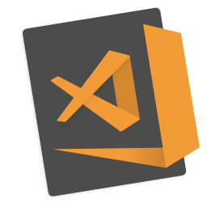
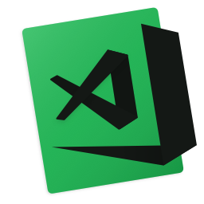
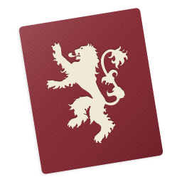
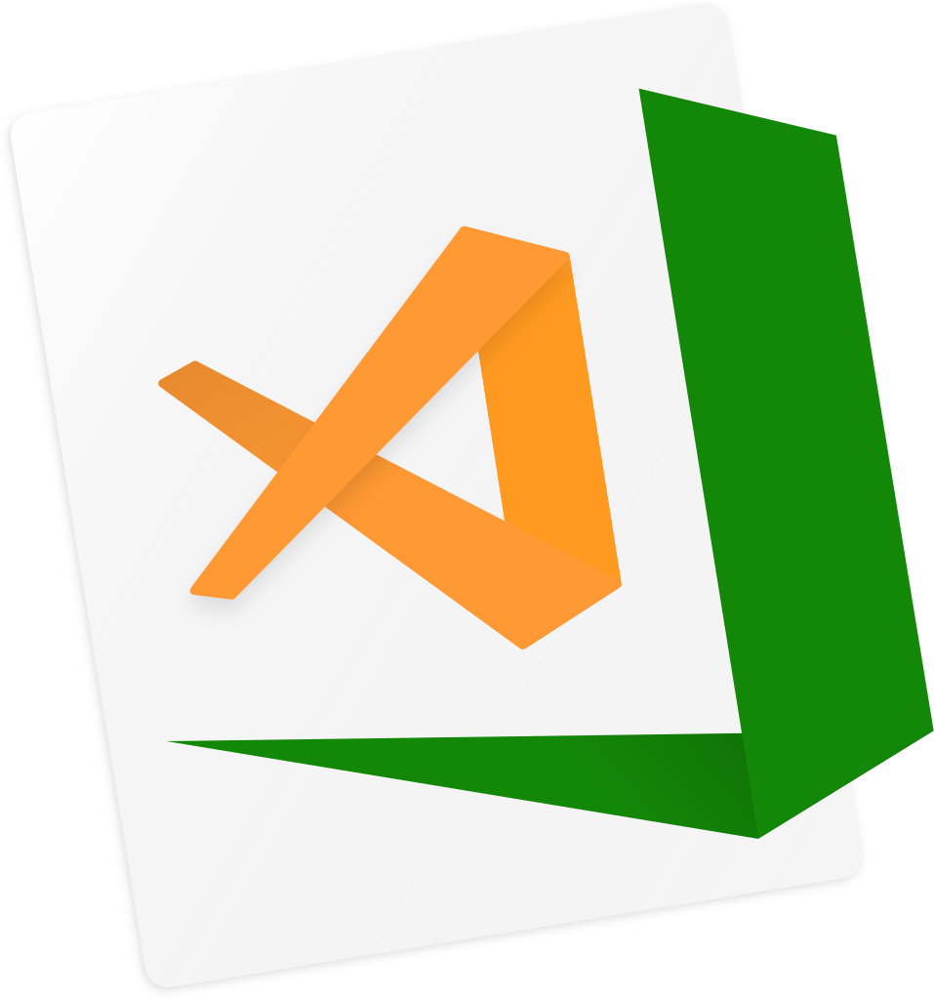

Visual Studio Code App Icons
======================================

A fun little project for custom [Microsoft® Visual Studio Code](http://code.visualstudio.com) Icons. All rights reserved with [@Microsoft](https://github.com/Microsoft) and the respective owners of the themes I am using whether it is Marvel, DC or simple editor themes.

---

## Hacktoberfest V

This was created by [Felix](https://github.com/fzeeb)

## Based on the Popular Themes

Hovering on them will reveal the names, and clicking them will take you to the theme pages.

             

## Based on Super Heroes

All rights reserved etc to DC and Marvel. I own nothing. Just inspired by the characters :)

             

## Apps, OS
                 

## Holidays
These icons were contributed by [@clarkio](https://github.com/clarkio)

         

## Movies, TVShows, Books and Games

       

These icons were contributed by [Jessica Van Rooyen](https://github.com/jessicavrooyen)

   

These icons were contributed by [Liam Richardson](https://github.com/discoliam)

           

This icon was contributed by [George](https://github.com/jorgeb12)

## Sports

These icons were contributed by [Aral Tasher](https://github.com/araltasher)

        

These icons were contributed by [Alex Aquino](https://github.com/alexaquino)

                    

## Countries

 

These icons were contributed by [Akash Debnath](https://github.com/reactuserakash)

This icon was contributed by [Rajdeep Ratan](https://github.com/rajdeepratan)

These icons were contributed by [Sem](https://github.com/semspanhaak)

These icons were contributed by [Harold AO](https://github.com/haroldao)

## Misc

    

These icons were contributed by [Andrew Mundy](https://github.com/andrewmundy)

   

## Pixar Characters

         

These icons were contributed by [Pantelis Eleftheriadis](https://github.com/panteliselef)

---

## How to Contribute

 - Download the `vscode.sketch` file
 - There are a lot of versions. It makes it easy to for anyone to change colors
 - Make a copy of any of the versions
 - Change the colors and create your icon
 - Select the artboard and export a `svg` file
 - Select the artboard again and export a `png` file, but @0.25x (256 x 256)
 - Open the terminal, go to the directory where the `svg` and `png` were exported
 - Run `sips -s format icns <nameOfIcon>.png --out <nameOfIcon>.icns`
 - Download ImageMagick:
   - [Homebrew](https://brew.sh): `brew install imagemagick`
   - [MacPorts](https://www.macports.org): `port install ImageMagick`
 - Run `convert -density 384 <nameOfIcon>.png <nameOfIcon>.ico`
 - Drop the files into their respective locations:
   - `png` to `vscode-icons/linux`
   - `icns` to `vscode-icons/macOS`
   - `ico` to `vscode-icons/windows`
   - `svg` to `vscode-icons/svg`
 - Make sure, the `vscode.sketch` file is saved and committed
 - Make sure you have not edited any icons other than your own
 - Send pull request

### [VSCode Icons Manager](https://github.com/Rawnly/vscode-icons-desktop)
Please check out this VSCode Icon Manager made in Electron by [Federico Vitale](https://github.com/Rawnly)

### [VSCode Icon Generator](https://vscode-icon-gen.herokuapp.com/)
An icon generator that allows you to easily change the background and accent colour online. Made by [DJDMorrison](https://github.com/djdmorrison)

## How to Install

**Mac OS:**

Easiest way to change the icons is by using https://freemacsoft.net/liteicon/. Just Drag and Drop the custom icon and hit `Apply Changes`.

Copy the `.icns` file you'd like to use. Find VS Code in your Applications folder, right click the icon and select `Get Info`. Click the icon in the top right corner so that a blue highlight appears around it. `⌘ + V` to paste the new icon in. It may take a few restarts of VS Code for the icon to take.

If for some reason that doesn't work, then dragging the `.icns` to the icon (in the top left) of the info pane, until you see the green plus sign and then dropping it works.

*Important Notes*
Once you have added the desired image, you may *delete* the source image after the icon has changes as OS X - Mojave are able to save this information without using the image path.

**Windows:**

Right click on the shortcut App Icon, select properties and then shortcut tab and then `change icon` button.

**Linux:**

Just change the icon path in the file at `/var/lib/snapd/desktop/applications/code_code.desktop`.

This file path may be different for your system, you can find the path through `locate code_code.desktop`.

### Contributions

Daredevil and Luke Cage by [@Rawnly](https://github.com/Rawnly)

Batgirl, Sublime Text, Neon, Spotify, White on Black and Black on White by [@fnky](https://github.com/fnky)

Monokai Pro and Night Owl by [@coltborg](https://github.com/coltborg)

Neon Set by [@andrewmundy](https://github.com/andrewmundy)

---
#### Disclaimer for Setapp
Icons inspired from Setapp brand colors are created by me. They are not created by Setapp or are based on their brand guidelines

You can get in touch with me at Twitter: [@dhanishgajjar](https://twitter.com/dhanishgajjar)
I post awesome stuff at Instagram: [@dhanishgajjar](https://instagram.com/dhanishgajjar)
