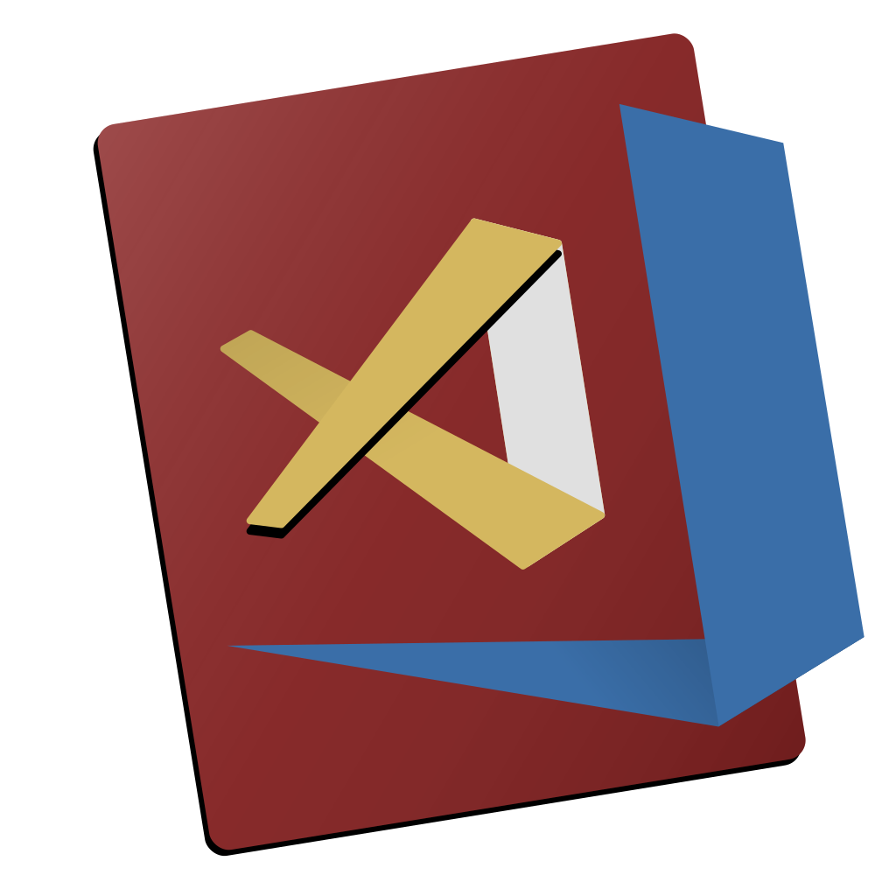
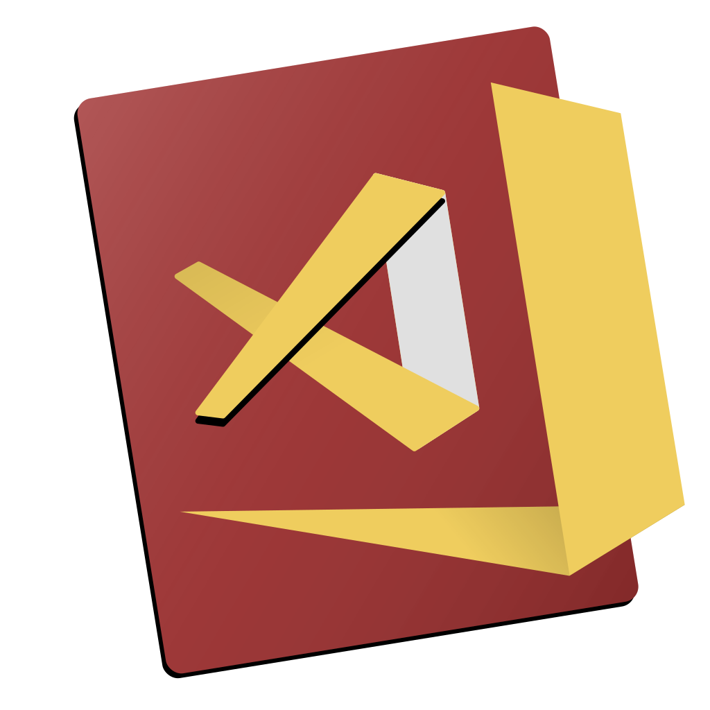
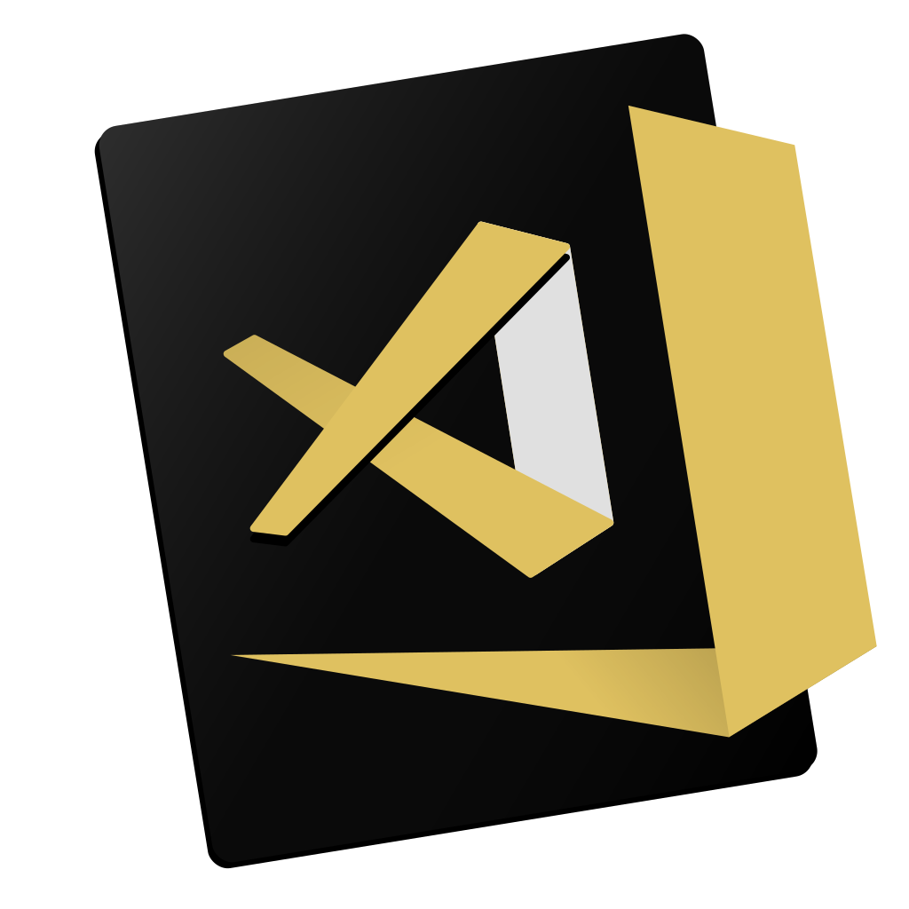
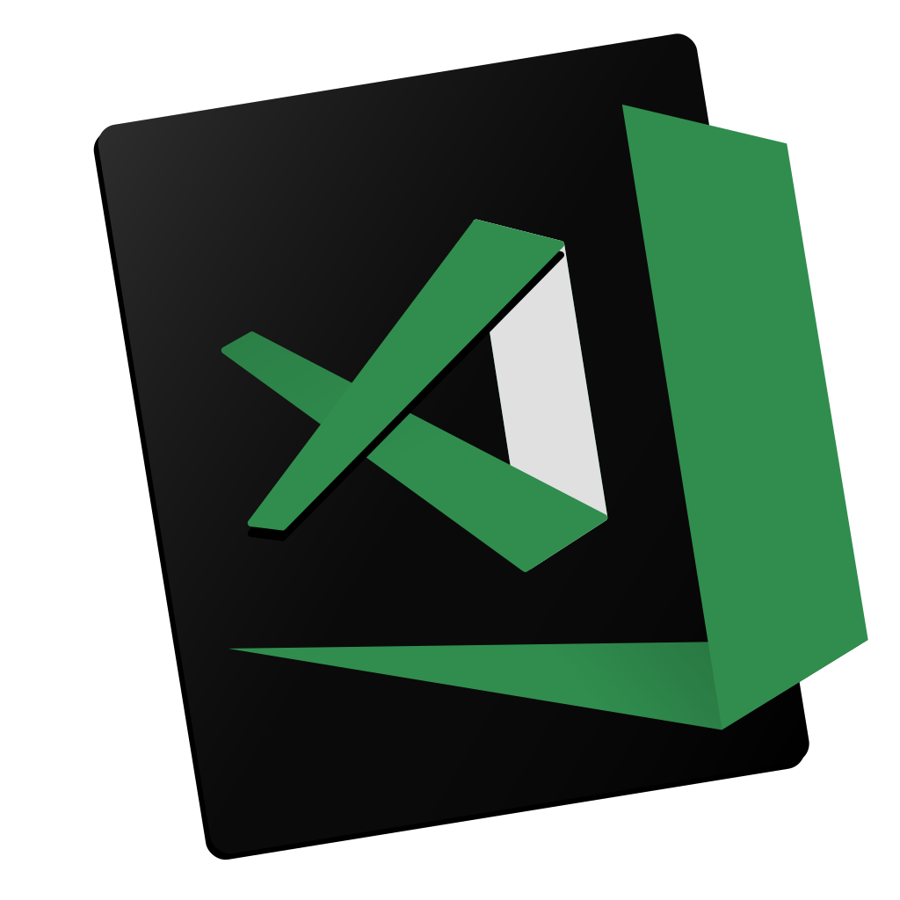
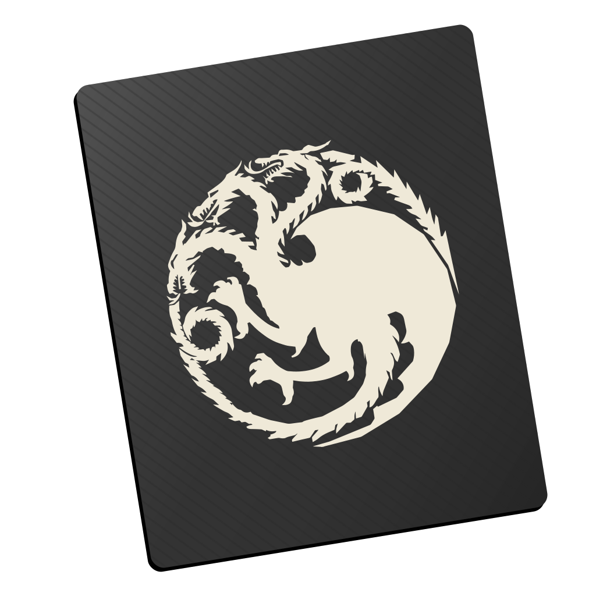
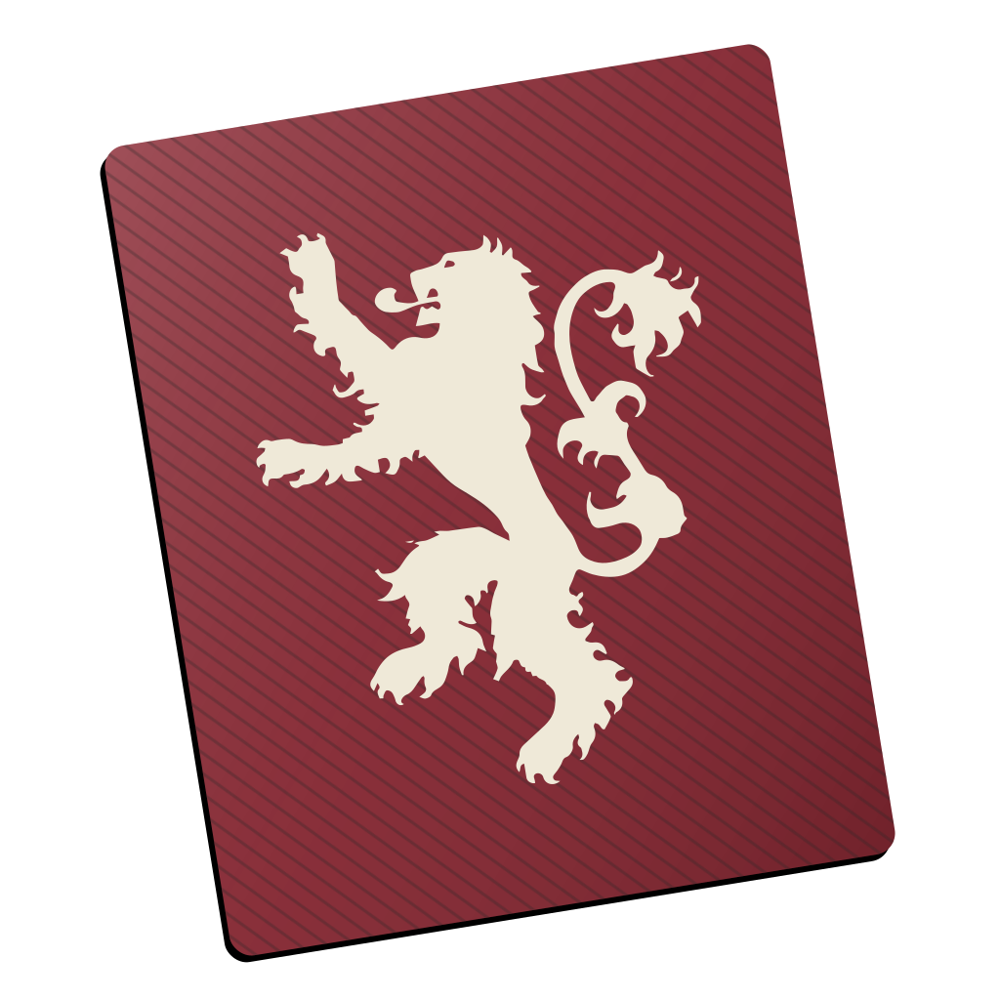
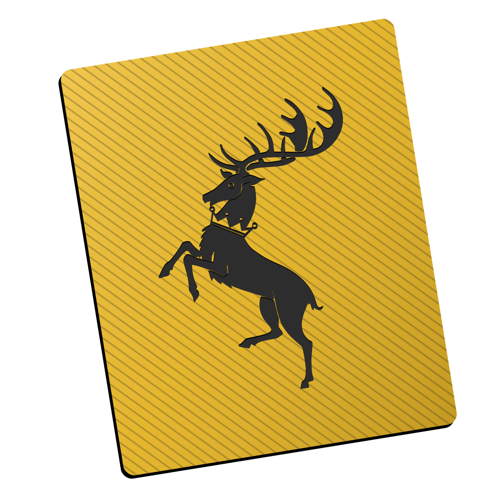
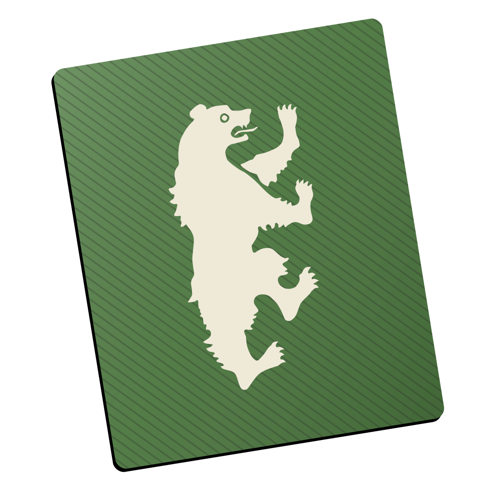
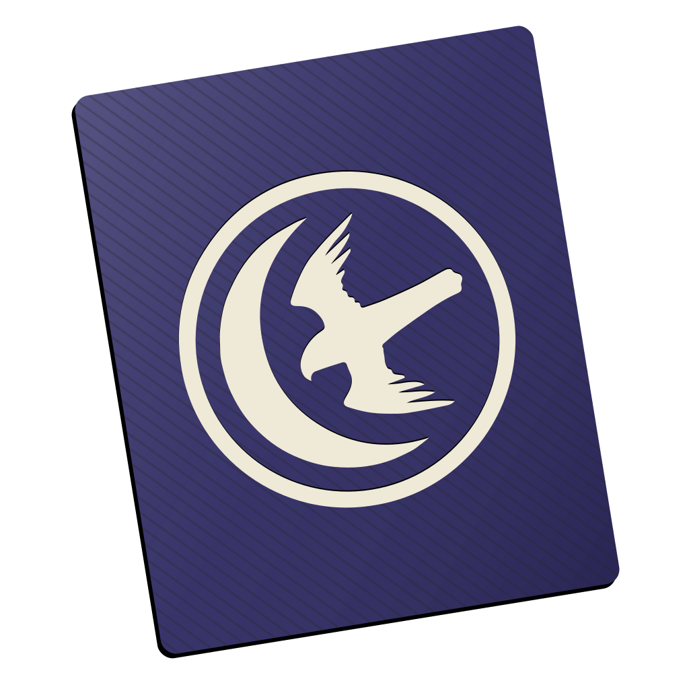
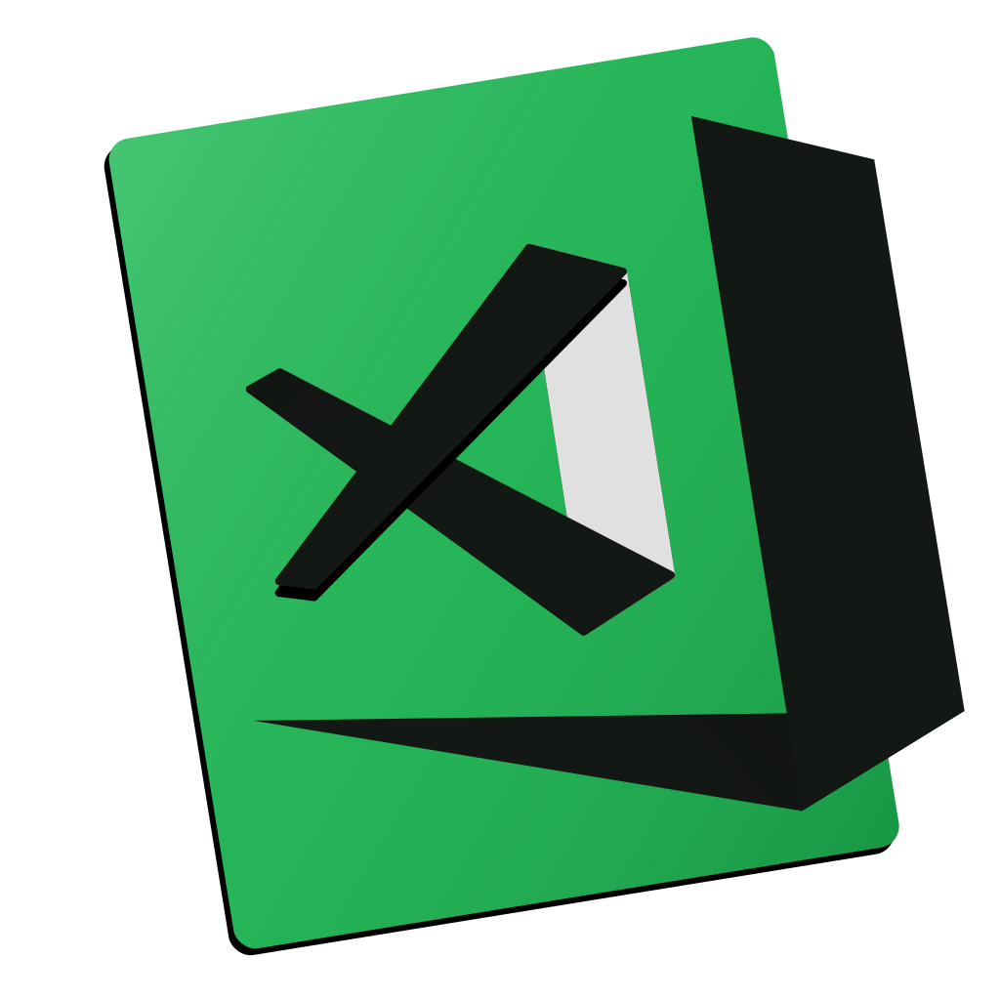

Visual Code App Icons
======================================

A fun little project for custom Microsoft® Visual Code Icons. All rights reserved to their respective owners of the themes I am using whether it is Marvel, DC or simple editor themes.

```
I am not accepting any Pull Requests till I fix the automation script. Won't take longer 👍🏼
```

## How to Install

**Mac OS:**

Easiest way to change the icons is by using https://freemacsoft.net/liteicon/. Just Drag and Drop the custom icon and hit `Apply Changes`.

Copy the `.icns` file you'd like to use. Find VS Code in your Applications folder, right click the icon and select `Get Info`. Click the icon in the top right corner so that a blue highlight appears around it. `⌘ + V` to paste the new icon in. It may take a few restarts of VS Code for the icon to take.

If for some reason that doesn't work, then dragging the `.icns` to the icon (in the top left) of the info pane, until you see the green plus sign and then dropping it works.

**Windows:**

Right click on the shortcut App Icon, select properties and then shortcut tab and then `change icon` button.

**Linux:**

I think this works, but not sure https://smdavis.us/projects/menulibre/

## Based on the Popular Themes

Hovering on them will reveal the names, and clicking them will take you to the theme pages.

<a href="https://marketplace.visualstudio.com/items?itemName=wesbos.theme-cobalt2"></a> <a href="https://www.leveluptutorials.com"></a> <a href="https://draculatheme.com/visual-studio-code/"></a> <a href="https://draculatheme.com/visual-studio-code/"></a> <a href="https://draculatheme.com/visual-studio-code/"></a> <a href="https://draculatheme.com/visual-studio-code/"></a> <a href="https://draculatheme.com/visual-studio-code/"></a> <a href="https://draculatheme.com/visual-studio-code/"></a> <a href="https://labs.voronianski.com/oceanic-next-color-scheme/"></a>

## Based on Harry Potter
These icons were created by [@jessicavrooyen](https://github.com/jessicavrooyen)

   

## Based on Super Heroes

All rights reserved etc to DC and Marvel. I own nothing. Just inspired by the character's costume colors :)

          


## Based on TV Shows
          
## Based on Popular Apps
  

## Others

  
----

### Contributions

Daredevil and Luke Cage by [@Rawnly](https://github.com/Rawnly)

Bat Girl, Sublime Text, Neon, Spotify, White on Black and Black on White by [@fnky](https://github.com/fnky)

---

You can get in touch with me at Twitter: [@dhanishgajjar](https://twitter.com/dhanishgajjar)

I post awesome stuff at
Instagram: [@dhanishgajjar](https://instagram.com/dhanishgajjar)
